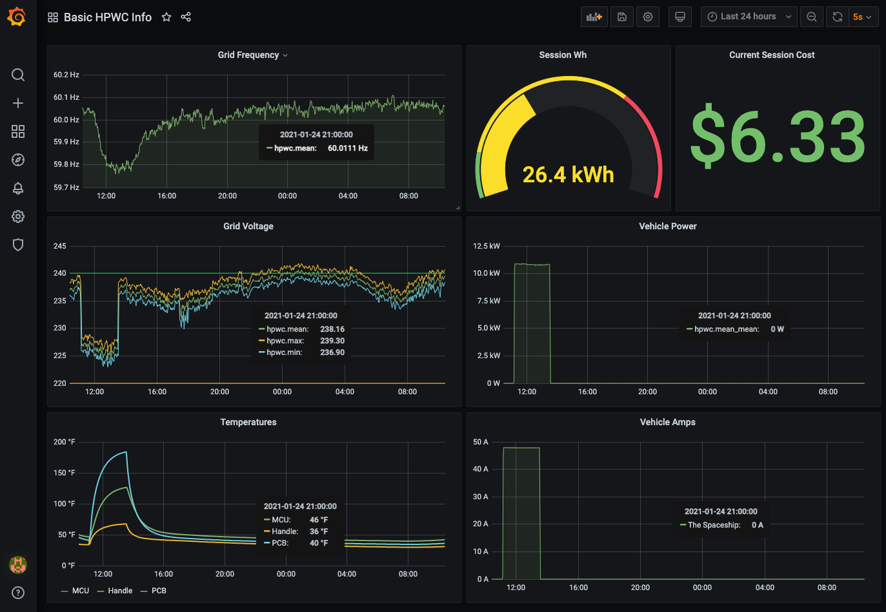

# tesla-gen3wc-monitor

A simple all-in-one stack for tracking detailed metrics from a [Tesla Gen 3 Wall Connector](https://shop.tesla.com/product/wall-connector) (a.k.a. HPWC) and visualizing the data. The real magic is `polly`, a Go-based API polling tool that converts JSON output from GETs to the HPWC to InfluxDB POSTs. We then visualize the data with Grafana.

A *particularly fascinating* detail I've learned about the Gen 3 HPWC is that it can deal with at least 10 samples per second, and it measures grid voltage and frequency with incredible accuracy: 4 significant digits for voltage, and 5 significant digits for grid frequency. It's like having a weathervane for your local electrical grid as a combo bonus with charging your car.

## Prerequisites

- You will need [Docker Desktop 3.1+](https://www.docker.com/products/docker-desktop) installed to run containers.
- You will need a [Tesla Gen 3 Wall Connector](https://shop.tesla.com/product/wall-connector) installed, provisioned, and joined to your home (or business) wifi.
- You will need to be able to reach the HPWC from whatever computer you run this stack on.

## Gotchas

- If you stop docker desktop, you lose all your collected data.
- If you run `docker-compose down`, same deal - you lose your collected data.
- This software is very rough and is provided with no warranty.
- I do math in the Grafana dashboard to turn °C into °F. Can't help it, I grew up this way. You can change it back to °C by removing the `math()` clause.

## Setup

Right now, the setup process is manual and requires changing hard-coded values. It isn't pretty, but I hope to make it much simpler and automated in the future.

1. Create two Docker volumes, one for each of the containers so they can persist some data: `docker volume create grafana-volume && docker volume create influxdb-volume`. I believe you only need to do this once.
1. Supply the IP address of your Gen 3 Wall Connector as an env var: `export HPWC_IP="<your IP Address>"`. For example, `export HPWC_IP="192.168.1.15"`.
1. Run `docker-compose up` to pull and start all three containers (`influxdb`, `grafana/grafana`, and `polly`).
1. Go to [localhost:3000](http://localhost:3000) and log in using the username `admin` and password `admin`.
1. Navigate to **Configuration > Data Sources** and click **Add Data Source**.
1. Choose **InfluxDB** and populate the URL field with `http://<your host's ip>:8086`, set **Database** to `tesla` and the **user** to `admin`.
1. Click **Save & Test**, and you should see a success message in green.
1. Navigate to **Dashboards > Manage** and click **Import**. Click **Upload JSON File** and at the dialog, supply `Basic HPWC Info Grafana Dashboard.json` from this repository.
1. *Ét violá!!* Go check out your dashboard at [http://localhost:3000/d/GqOd0wfGk/basic-hpwc-info](http://localhost:3000/d/GqOd0wfGk/basic-hpwc-info)

*Note: You can accurately represent your local electrical cost by changing line 321 of the dashboard JSON from 0.24 (my cost per kWh) to whatever it is for you.*

## Running the Gen 3 Wall Connector monitor without Docker

If you already have InfluxDB running in your environment and just just want to run the Gen 3 Wall Connector monitor in your terminal, it's pretty easy:

1. Set both `HPWC_IP` and `INFLUX_IP` as environment variables: `export HPWC_IP="<your IP Address>" && export INFLUX_IP="<your IP Address>"`. For example, `export HPWC_IP="192.168.1.5" && export INFLUX_IP="192.168.1.6"`
2. Compile and run the main executable in one simple command: `go run main.go`

This process depends on InfluxDB being reachable over http (*not https!!*) on port 8086 and having a database called `tesla`.

## Wish List

- Gen 3 WC finder: scans through the active subnet of the host (assuming a home network) and locates the HPWC(s), supplying the IP(s) as target(s) for `polly` to poll.
- [x] (deprecated) Setup Script: simple Q-and-A interactive script that does all the work and then spins up the stack.
- [x] polly as Container: use env vars for endpoint addresses and run it in a vanilla container.
